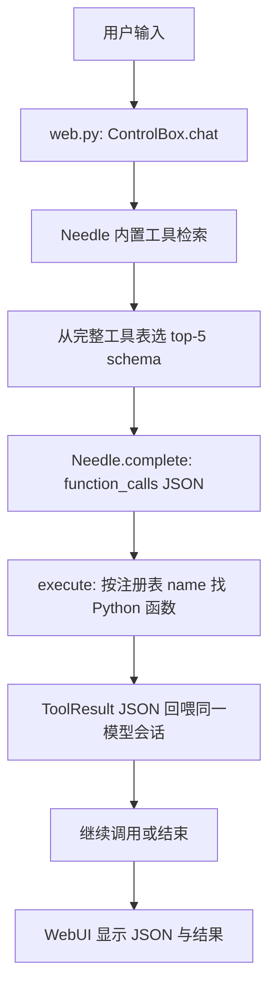

# AI 控制盒

一个在 Windows 上运行的本地工具调用原型。页面接收一句指令，Needle 只输出结构化工具调用，Python 再从已注册工具表中执行对应函数，并把固定中文结果显示回页面。

它不是聊天模型：Needle 3 的职责只是把指令变成 `name + arguments` JSON。

## 启动

双击 [run.bat](run.bat)，首次启动会创建 `.venv` 并安装 `requirements.txt` 中的依赖；浏览器会自动打开本地页面。

也可以在项目根目录执行：

```cmd
run.bat
```

服务使用随机可用端口，因此每次启动时浏览器地址可能不同。

## 目录

```text
ai-control-box/
├─ run.bat                     # Windows 启动入口
├─ main.py                     # 仅启动 Web 服务
├─ settings/
│  └─ environment.json         # 城市、经纬度等可修改环境信息
├─ agent/
│  ├─ web.py                   # WebUI、/api/chat 与 /api/settings
│  ├─ models.py                # 工具候选 → Needle 模型实例
│  ├─ needle.py                # 唯一的 Needle 适配边界
│  ├─ config.py                # 读写 settings/environment.json
│  ├─ tools/
│  │  ├─ runtime.py             # 扫描插件、生成 schema、执行与自动重载
│  │  └─ plugins/               # 每个工具插件一个文件夹
│  │     ├─ simulated_home/     # 模拟灯、风扇、室温
│  │     ├─ environment/        # 系统时间、Open-Meteo 天气
│  │     └─ tool_catalog/       # 动态列出当前工具
│  └─ static/                  # 单页纯黑 WebUI 与图标
└─ models/                     # 预留给未来手动放置 .cact 权重
```

## 实际调用流程



例如输入 `turn on the bedroom light to 20 percent`：

1. 运行时扫描所有已安装插件，合并成完整英文工具表；Needle 从中以内置检索选出最多 5 个候选 schema。
2. Needle 只在本轮上下文看到候选 schema，返回：

   ```json
   {"name":"set_light","arguments":{"room":"bedroom","brightness":20}}
   ```

3. `execute()` 从 `TOOLS` 注册表取出 `set_light(**arguments)` 执行。
4. 工具结果 JSON 回喂 Needle；它可继续调用其他工具或结束。
5. 页面显示 `卧室灯已打开，亮度 20%`。

每条网页输入都是独立的模型会话。工具结果只在当前输入的最多三步循环内回喂，不会污染下一条设备指令。

Needle 在工具超过 5 个时会自动以其内置检索头选择 top-5 并约束调用语法。对 `time`、`fan`、`weather` 这类明确英文领域词，schema 还附有 Needle 原生触发规则，确保检索时不会漏掉对应候选；应用本身不直接选择或执行工具。`models/needle-tools.idx` 是传给 Needle 的索引持久化路径；它不是权重，也不会执行工具。没命中时，系统返回空 `function_calls`。

## 工具插件与自动更新

所有工具（包括现有模拟设备、时间、天气和 `list_tools`）都是 `agent/tools/plugins/<插件 id>/` 下的插件。一个插件至少包含：

```text
esp32_ir/
├─ manifest.json    # 英文 schema、中文展示文案、入口与参数约束
└─ tool.py          # 返回 ToolResult 的 Python 函数
```

设置页会显示每个工具的中文名称、中文描述及所属插件；“安装文件夹”可选择一个包含 `manifest.json` 的本地插件目录。安装后会自动扫描，不需要刷新按钮。

运行时会检测 `plugins/` 目录的新增、删除和修改：下一条消息前自动重建工具注册表及 Needle 模型；新建对话也会强制检查一次。完整 schema 表交给 Needle 的内置检索，实际注入仍最多 top-5，不会因插件增加而把全部工具塞进短上下文。`list_tools()` 也读取这份动态注册表。

首次安装同 ID 的插件后，如需更新，直接修改其 `agent/tools/plugins/<插件 id>/` 文件夹；检测到文件变化后会自动生效。当前安装器不会覆盖同 ID 的现有插件。

## 已有工具

| 工具 | 作用 |
| --- | --- |
| `set_light(room, brightness)` | 模拟灯光和亮度 |
| `set_fan(room, level)` | 模拟风扇档位 |
| `get_temperature(room)` | 模拟房间温度 |
| `get_system_time()` | Windows 系统时间 |
| `get_weather()` | 当前配置坐标的实时天气 |
| `list_tools()` | 输出英文 `name / description` 工具表 |

天气调用 Open-Meteo；位置由 [settings/environment.json](settings/environment.json) 决定，也可在网页右上角齿轮中修改。城市字段用于显示，经纬度才是实际查询依据。

## Needle 模型与运行文件

当前仓库**不带模型文件**。`agent/needle.py` 创建的是 `needle.Needle(..., generation=3)`，没有传入 `weights` 路径，因此 `cactus-needle==3.0.1` 自动使用用户缓存：

```text
C:\Users\<用户名>\.cache\cactus-needle\v3\3.0.1\libneedle.dll
C:\Users\<用户名>\.cache\cactus-needle\v3\3.0.1\needle3.cact
```

在当前电脑上，`needle3.cact` 约为 35 MB。首次缺少运行库或权重时，Needle 会下载它们，因此第一次启动需要网络；之后可从缓存运行。

`models/` 目前只有占位文件，尚未接入。以后若要把权重随项目或设备一起带走，应把 `.cact` 放进 `models/`，并在 `agent/needle.py` 创建 `Needle` 时显式传入 `weights=".../models/needle3.cact"`；引擎 DLL 仍可继续使用缓存，或通过 `NEEDLE3_LIB_PATH` 指向设备上的 DLL。

`.venv/`、缓存和 `models/*.cact` 都被 Git 忽略，不会被提交到仓库。

## Qwen 本地模型

设置弹窗分为“常规 / 下载 / 模型”。只使用 Needle 时，不会下载 Qwen 或 llama-server。

在“模型”中点击未安装的 Qwen 项会切到“下载”；点击下载时，如果本机尚未准备 llama-server，会先确认下载该依赖，随后自动继续下载模型。Qwen 模型从 Hugging Face 下载到 `models/`，运行时从 llama.cpp 官方发行包下载到 `runtime/bin/`；两者都不会提交 Git。

首次选择已安装的 Qwen 并发送指令时，应用会在本机启动 llama-server。Qwen 每条输入先由宿主使用插件 manifest 中的中英关键词做轻量检索，只注入最多 5 个相关 schema；关联工具可一并注入。候选工具只用于压缩上下文，不是执行白名单：实际执行仍由动态 ToolRegistry 按名称解析。向量检索尚未接入。

## 增加一个工具

1. 新建 `agent/tools/plugins/<插件 id>/manifest.json` 和 `tool.py`。
2. 在 manifest 中填写英文 `name`、`description`、参数 schema、触发词，以及中文 `name_zh`、`description_zh`。为 Qwen 增加 `index.keywords`（中英关键词）；需要连续调用的工具可用 `index.related_tools` 声明关联工具。
3. 在 `tool.py` 写同名函数并返回 `ToolResult`；保存后自动扫描。
4. 通过网页提交一条明确英文指令，确认 JSON、执行结果都正确。

小模型的 schema 与演示指令目前以英文为主；内置检索也依赖这些英文工具描述，不能替代模型本身的中文理解能力。

执行前会检查原始指令中的参数范围。例如风扇只接受 `level` 1～3，`fan speed 100` 会返回 `set_fan: level must be between 1 and 3.`，不会忽略 `100` 后执行默认档位。当前房间仅支持 `bedroom`、`living room`、`kitchen`。

每次成功调用底部会显示 `耗时 · tok/s`，例如 `0.18s · 557 tok/s`。耗时覆盖模型筛选、Needle 推理与工具执行；`tok/s` 使用 Needle 返回的生成速度。

## 当前范围

- 纯本地 WebUI：对话、调用结果、新建对话、位置设置。
- 模拟设备动作、系统时间、在线天气。
- 不包含真实 MQTT/ESP32/树莓派控制、账号、数据库或多对话持久化。
