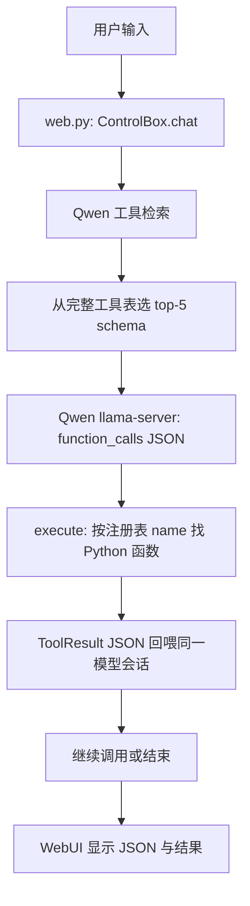

# AI 控制盒

一个在 Windows 上运行的本地工具调用原型。默认使用通过 llama.cpp 运行的 Qwen 小模型，将中文或英文指令变成结构化工具调用；Python 再从已注册工具表中执行对应函数，并把固定中文结果显示回页面。

它不是开放式聊天模型：模型的职责只是把指令变成受限的 `name + arguments` JSON。

## 启动

双击 [run.bat](run.bat)，首次启动会创建 `.venv` 并安装 `requirements.txt` 中的依赖；浏览器会自动打开本地页面。

也可以在项目根目录执行：

```cmd
run.bat
```

服务使用随机可用端口，因此每次启动时浏览器地址可能不同。

## 目录

```text
ai-control-box/
├─ run.bat                     # Windows 启动入口
├─ main.py                     # 仅启动 Web 服务
├─ settings/
│  └─ environment.json         # 城市、经纬度等可修改环境信息
├─ agent/
│  ├─ web.py                   # WebUI、/api/chat 与 /api/settings
│  ├─ models.py                # 工具候选 → Needle 模型实例
│  ├─ needle.py                # 唯一的 Needle 适配边界
│  ├─ config.py                # 读写 settings/environment.json
│  ├─ tools/
│  │  ├─ runtime.py             # 扫描插件、生成 schema、执行与自动重载
│  │  └─ plugins/               # 每个工具插件一个文件夹
│  │     ├─ simulated_home/     # 模拟灯、风扇、室温
│  │     ├─ environment/        # 系统时间、Open-Meteo 天气
│  │     └─ tool_catalog/       # 动态列出当前工具
│  └─ static/                  # 单页纯黑 WebUI 与图标
└─ models/                     # 预留给未来手动放置 .cact 权重
```

## 实际调用流程


```mermaid
flowchart TD
    A[用户输入] --> B[web.py: ControlBox.chat]
    B --> C[Qwen 工具检索]
    C --> D[从完整工具表选 top-5 schema]
    D --> E[Qwen llama-server: function_calls JSON]
    E --> F[execute: 按注册表 name 找 Python 函数]
    F --> G[ToolResult JSON 回喂同一模型会话]
    G --> H[继续调用或结束]
    H --> I[WebUI 显示 JSON 与结果]
```

例如输入 `turn on the bedroom light to 20 percent`：

1. 运行时扫描所有已安装插件，合并成完整工具表；Qwen 从中检索最多 5 个候选 schema，并同时看到对应的中文工具说明。
2. Needle 只在本轮上下文看到候选 schema，返回：

   ```json
   {"name":"set_light","arguments":{"room":"bedroom","brightness":20}}
   ```

3. `execute()` 从 `TOOLS` 注册表取出 `set_light(**arguments)` 执行。
4. 一个指令中的工具结果由页面显示；同一轮 Qwen 可以输出多个独立动作。
5. 页面显示 `卧室灯已打开，亮度 20%`。

每条网页输入都是独立的模型会话。工具结果只在当前输入的最多三步循环内回喂，不会污染下一条设备指令。

Qwen 在工具超过 5 个时通过 llama-server 的 embedding 接口检索 top-5 候选；每个候选都带有中文名称、描述和参数别名，便于理解“打开卧室灯”“客厅风扇关掉”等指令。应用本身不直接选择或执行工具。没命中时，系统返回空 `function_calls`。

## 工具插件与自动更新

所有工具（包括现有模拟设备、时间、天气和 `list_tools`）都是 `agent/tools/plugins/<插件 id>/` 下的插件。一个插件至少包含：

```text
esp32_ir/
├─ manifest.json    # 英文 schema、中文展示文案、入口与参数约束
└─ tool.py          # 返回 ToolResult 的 Python 函数
```

设置页会显示每个工具的中文名称、中文描述及所属插件；“安装文件夹”可选择一个包含 `manifest.json` 的本地插件目录。安装后会自动扫描，不需要刷新按钮。

运行时会检测 `plugins/` 目录的新增、删除和修改：下一条消息前自动重建工具注册表及 Needle 模型；新建对话也会强制检查一次。完整 schema 表交给 Needle 的内置检索，实际注入仍最多 top-5，不会因插件增加而把全部工具塞进短上下文。`list_tools()` 也读取这份动态注册表。

首次安装同 ID 的插件后，如需更新，直接修改其 `agent/tools/plugins/<插件 id>/` 文件夹；检测到文件变化后会自动生效。当前安装器不会覆盖同 ID 的现有插件。

## 已有工具

| 工具 | 作用 |
| --- | --- |
| `set_light(room, brightness)` | 模拟灯光和亮度；`brightness: 0` 关闭 |
| `set_fan(room, level)` | 模拟风扇档位；`level: 0` 关闭 |
| `get_temperature(room)` | 模拟房间温度 |
| `get_system_time()` | Windows 系统时间 |
| `resolve_city(city)` | 将城市名称转换为城市 ID、经纬度 |
| `get_device_location(device)` | 查询模拟设备的当前城市与经纬度 |
| `get_weather(city, latitude, longitude)` | 查询指定城市或当前配置坐标的实时天气 |
| `list_tools()` | 输出英文 `name / description` 工具表 |

天气调用 Open-Meteo；位置由 [settings/environment.json](settings/environment.json) 决定，也可在网页右上角齿轮中修改。城市字段用于显示，经纬度才是实际查询依据。

## Qwen 小模型与运行文件

默认模型为 Qwen，经本机 llama.cpp 的 `llama-server` 调用；仓库不附带模型权重。把兼容的 Qwen 2.5 1.5B Instruct GGUF（建议 Q4 量化）放到本机任意目录，然后先启动 llama-server。例如：

```cmd
llama-server -m D:\models\qwen2.5-1.5b-instruct-q4_k_m.gguf --embedding --port 8080
```

保持此窗口运行后，再双击 `run.bat`。设置页中的 `llama-server` 和 `embedding server` 默认均为 `http://127.0.0.1:8080`，需要使用不同服务时可分别填写。模型未启动时，页面会显示“Qwen llama-server 不可用”，不会执行任何工具。

GitHub 仓库只包含源码和下载脚本，不包含大模型或编译好的运行程序。首次使用时运行 `runtime/setup-qwen.ps1`，它会下载 llama.cpp 与 Qwen 到当前项目；再双击 `runtime/start-llama-server.bat`，让 AI Control Box 或同一台电脑上的其他应用使用 `http://127.0.0.1:8080`；详细说明见 `runtime/README.md`。

可直接输入：`打开卧室灯，亮度 40%`、`把客厅风扇调到 2 档`、`关闭厨房灯`、`卧室现在多少度`。房间支持卧室、客厅、厨房；模型会转换成受限的英文工具参数，工具层也可识别这些中文房间名。

查询城市天气会自动使用两步工具链。例如“南京的天气怎么样”先调用 `resolve_city("南京")`，获得城市 ID、纬度和经度；再调用 `get_weather(...)` 返回实时天气。该链路最多继续一步，避免无状态模型重复执行设备动作。

查询设备所在地天气同样使用两步工具链。例如“客厅传感器当前位置的天气怎么样”先调用 `get_device_location("living_room_sensor")`，再用该设备的城市和坐标调用 `get_weather(...)`。三个初始模拟设备及其位置保存在 `settings/device_locations.json`，可直接修改城市和经纬度；它们不是实时 GPS 数据。


## 可选的 Needle 模型与运行文件

当前仓库**不带模型文件**。`agent/needle.py` 创建的是 `needle.Needle(..., generation=3)`，没有传入 `weights` 路径，因此 `cactus-needle==3.0.1` 自动使用用户缓存：

```text
C:\Users\<用户名>\.cache\cactus-needle\v3\3.0.1\libneedle.dll
C:\Users\<用户名>\.cache\cactus-needle\v3\3.0.1\needle3.cact
```

在当前电脑上，`needle3.cact` 约为 35 MB。首次缺少运行库或权重时，Needle 会下载它们，因此第一次启动需要网络；之后可从缓存运行。

`models/` 目前只有占位文件，尚未接入。以后若要把权重随项目或设备一起带走，应把 `.cact` 放进 `models/`，并在 `agent/needle.py` 创建 `Needle` 时显式传入 `weights=".../models/needle3.cact"`；引擎 DLL 仍可继续使用缓存，或通过 `NEEDLE3_LIB_PATH` 指向设备上的 DLL。

`.venv/`、缓存和 `models/*.cact` 都被 Git 忽略，不会被提交到仓库。

## 增加一个工具

1. 新建 `agent/tools/plugins/<插件 id>/manifest.json` 和 `tool.py`。
2. 在 manifest 中填写英文 `name`、`description`、参数 schema、触发词，以及中文 `name_zh`、`description_zh`。
3. 在 `tool.py` 写同名函数并返回 `ToolResult`；保存后自动扫描。
4. 通过网页提交一条明确英文指令，确认 JSON、执行结果都正确。

Qwen 的检索资料和提示词包含中文工具说明，但它仍只能调用已注册的工具；它不能控制真实设备，也不会执行任意系统命令。

执行前会检查原始指令中的参数范围。例如风扇只接受 `level` 0～3，`fan speed 100` 会返回 `set_fan: level must be between 0 and 3.`，不会忽略 `100` 后执行默认档位。当前房间仅支持 `bedroom`、`living room`、`kitchen` 及其中文名称。

每次成功调用底部会显示 `耗时 · tok/s`，例如 `0.18s · 557 tok/s`。耗时覆盖模型筛选、Needle 推理与工具执行；`tok/s` 使用 Needle 返回的生成速度。

## 当前范围

- 纯本地 WebUI：对话、调用结果、新建对话、位置设置。
- 模拟设备动作、系统时间、在线天气。
- 不包含真实 MQTT/ESP32/树莓派控制、账号、数据库或多对话持久化。
