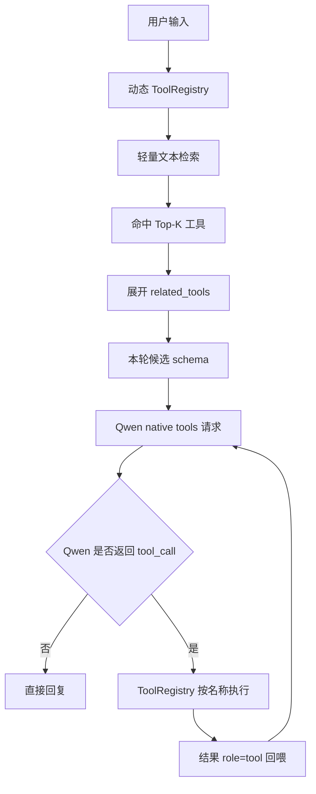

# Qwen 动态工具检索设计

## 目标

Qwen 不再在每一次模型请求中接收全部热插拔工具 schema。宿主根据当前用户输入从动态插件目录检索少量相关工具，并把这些候选工具的完整 OpenAI function schema 注入本轮 Qwen 上下文。

这只缩小模型可见的说明，不是执行白名单。模型返回任意工具名后，仍由动态 `ToolRegistry` 在执行时确认该工具是否存在。

## 已确认边界

- 工具继续从 `agent/tools/plugins/<plugin id>/manifest.json` 热插拔加载。
- Qwen 每条网页消息仍是独立单轮；同一条消息中的工具结果会回喂并允许最多五步循环。
- 检索不使用 embedding、向量数据库或模型额外调用；首版必须能在边缘设备上低成本运行。
- 索引同时支持中文和英文关键词。
- 候选工具数量固定为最多 5 个。候选集在同一条消息的后续工具循环中保持不变。
- 注册表是唯一执行来源；检索层不得拦截、批准或替换模型返回的工具调用。
- Needle 保持自己的内置检索流程，不改动其 schema 传入方式。

## Manifest 扩展

每个工具可选增加 `index` 字段，且不将该字段送进 Qwen 的 function schema：

```json
{
  "name": "get_weather",
  "description": "Read weather data for a location.",
  "index": {
    "keywords": ["weather", "forecast", "temperature", "天气", "温度", "降雨", "逐小时"],
    "related_tools": ["search_location"]
  }
}
```

没有 `index` 的旧插件仍可加载。它至少按工具英文名称和英文 description 参与检索，避免破坏现有插件。

`related_tools` 用于声明工作流依赖。它只把关联工具的 schema 一并展示给模型；是否调用仍由模型决定。

## 检索流程



检索采用无额外模型依赖的归一化词匹配：优先匹配中文或英文关键词，其次匹配工具名与 description。相同分数时按注册表加载顺序稳定排序。

若没有命中，Qwen 接收空工具列表，作为普通聊天回复；不回退为全量 schema 注入。

## 位置与天气后续扩展

本设计只提供候选 schema 注入能力，暂不增加地点或天气功能。之后增加时建议：

```text
search_location(query) -> 首个地点的 location_id
get_weather(location_id?, view, fields, hours, forecast_days)
```

`get_weather` 声明 `related_tools: ["search_location"]`。用户明确给出地点时，模型能在同一轮看到两者并先查地点；未给出地点时天气工具使用现有设置坐标。地点候选始终取 Open-Meteo 搜索第一项，不启用多轮候选确认。

天气的 `current`、`hourly`、`daily` 参数与实际 API 实现属于下一项工作，不能在本次检索改动中一并加入。

## 验收标准

1. 为 Qwen 发送 `get_weather` 相关请求时，请求 `tools` 中含天气工具及其关联工具，不含无关家居工具。
2. 为 Qwen 发送灯光请求时，请求 `tools` 中含灯光工具，不含无关天气工具。
3. 同一轮的后续 tool-result 回喂请求沿用首轮候选集。
4. 插件新增、删除或修改 index 内容后，下一条消息自动反映变化。
5. 旧 manifest 没有 `index` 时，工具继续正常加载、执行与显示。
6. 模型返回未注册工具名时，仍由注册表返回“没有名为 … 的动作”；检索层不充当执行授权。
7. Needle 路径的现有调用与内置 top-5 检索保持可用。

## 刻意不做

- 不加入 embedding、向量数据库、知识库或模型调用式 `tool_search`。
- 不在本次增加 `search_location`、扩展 Open-Meteo 字段或更改 WebUI。
- 不新增工具确认、风险分类、执行白名单或关键词硬路由。
